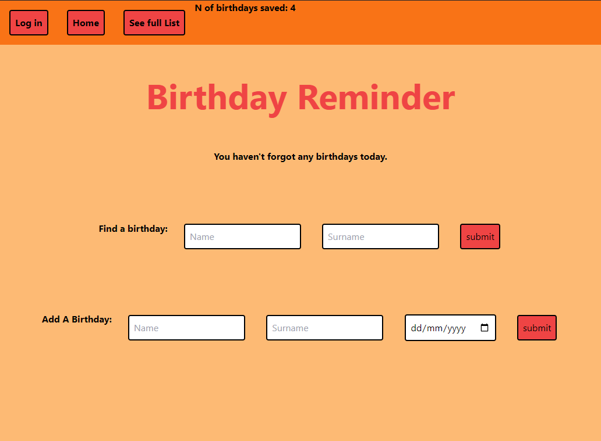

# Birthday Reminder 

The main goal of this project was to enhance back-end development skills while creating a practical application to store and manage birthdays. The app allows users to add, update, and delete birthdays, which are then stored in a database. Users can later access these birthdays to get timely reminders and celebrate the special occasions of their friends and family.

Link to the project: https://birthday-app-u9ct.onrender.com

#

How is made

The Birthday Reminder App is a web application built using Node.js, Express, and Vanilla JavaScript. 

Features:

Adding Birthdays: users can easily add new birthdays, including the person's name and birthdate. The app validates the input and ensures no duplicate entries are allowed.

Viewing and Managing Birthdays: The app provides a user-friendly interface to view all the stored birthdays. Users can edit or delete any birthday entry as needed.

Birthday Reminders: The app is designed to send timely reminders to users for upcoming birthdays. This ensures that they never miss a special occasion and can plan celebrations in advance.

Database Integration: The project leverages a database, MongoDBb , to store the birthday data securely. The database integration enhances the scalability and persistence of the application.

Front-end UI: Though the front-end UI is not heavily focused on aesthetics, it offers a clean and straightforward design. The user interface is intuitive, making it easy for users to navigate and interact with the application.

#

What I have learned?

This app is a practical project that demonstrates proficiency in Node.js, Express, and Vanilla JavaScript. By creating this web application, I have honed your back-end skills and gained experience in database integration. While the front-end UI may not be polished, the project's core functionalities make it a valuable tool for users who wish to store and access birthdays conveniently. With further improvements and refinements, this application can be enhanced to cater to a broader audience and serve as a useful reminder tool for many users.
